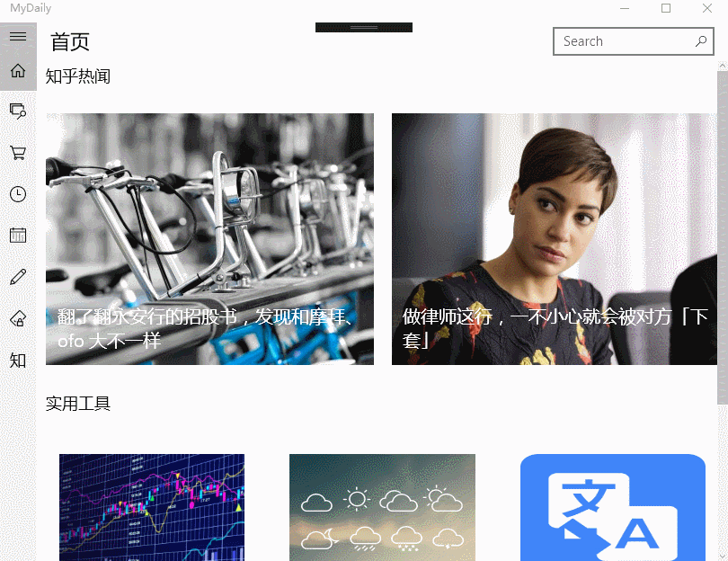

# MyDaily

## 计划内容：

1. 首页显示知乎日报文章
2. 查询天气，股票，快递，翻译等
3. 消费记录，分析消费，可设置每月上限
4. 番茄时钟
5. 备忘日程
5. 笔记本
6. 私密日记

### 首页Demo:

### 知乎日报Demo:

----

*参考*

http://www.cnblogs.com/xiaozhi_5638/p/5056217.html
https://github.com/sherlockchou86/ZhiHuDaily.UWP/blob/master/ZhiHuDaily.UWP.Core/Https/ServiceURL.cs

*有道翻译api*

http://fanyi.youdao.com/openapi.do?keyfrom=MyDaily&key=1146739795&type=data&doctype=json&version=1.1&q={0} 0为要翻译的文本